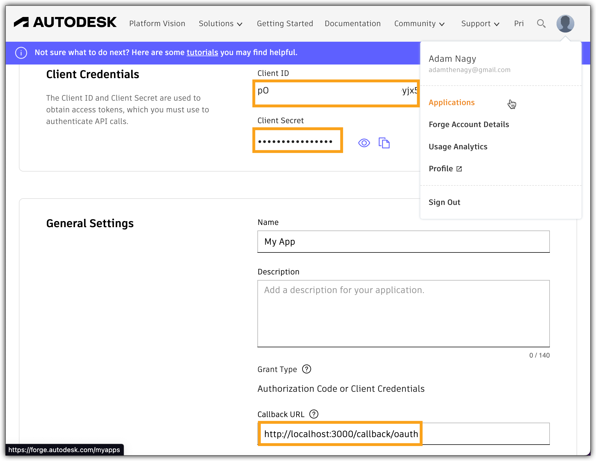
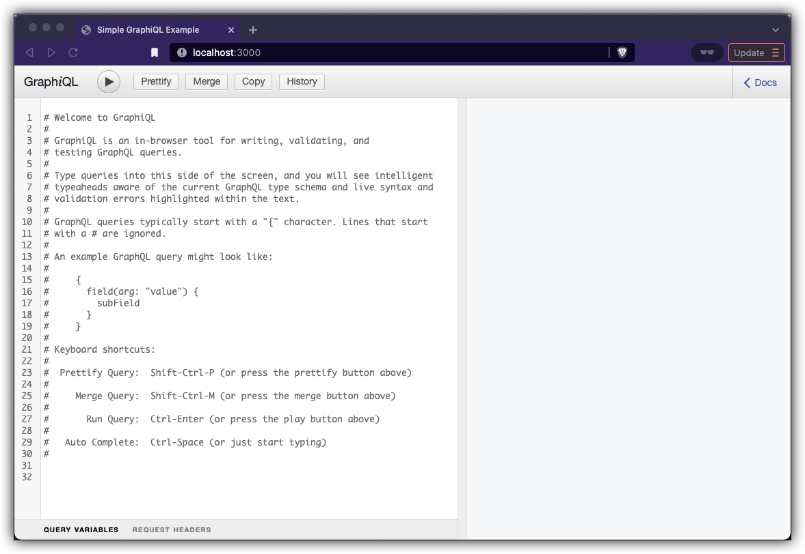
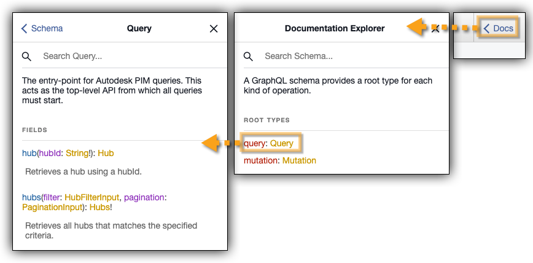
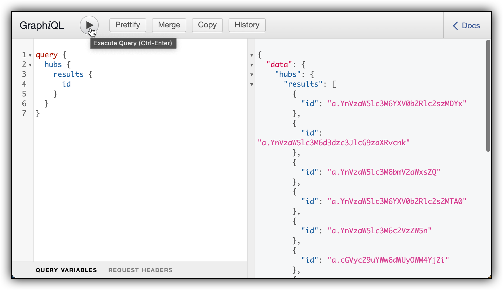

# Data Explorer

The sample is using this [GraphiQL project](https://github.com/graphql/graphiql) that makes it really easy to discover the various GraphQL APIs we provide

## Setting up the app
In the **terminal** run this to install all the necessary components
```
npm i
``` 

You will need to set the value of `clientId` and `clientSecret` variables in `index.js` based on your **APS app**'s credentials and make sure that the `CallBack URL` of the app is set to `http://localhost:3000/callback/oauth` as shown in the picture\

You also need to set the `dataEndpoint` variable's value, which e.g. in case of the [Fusion Data API](https://forge.autodesk.com/en/docs/fusiondata/v1/developers_guide/overview/) is "https://developer.api.autodesk.com/manufacturing/graphql/v1"

## Running the app
In a **terminal**, you can run the test with:
```
npm start
```
As instructed in the console, you'll need to open a web browser and navigate to http://localhost:3000 in order to log into your Autodesk account 

## Output

Once you logged in with your Autodesk account in the browser, this should appear:



Now you can check the documentation



And run queries



