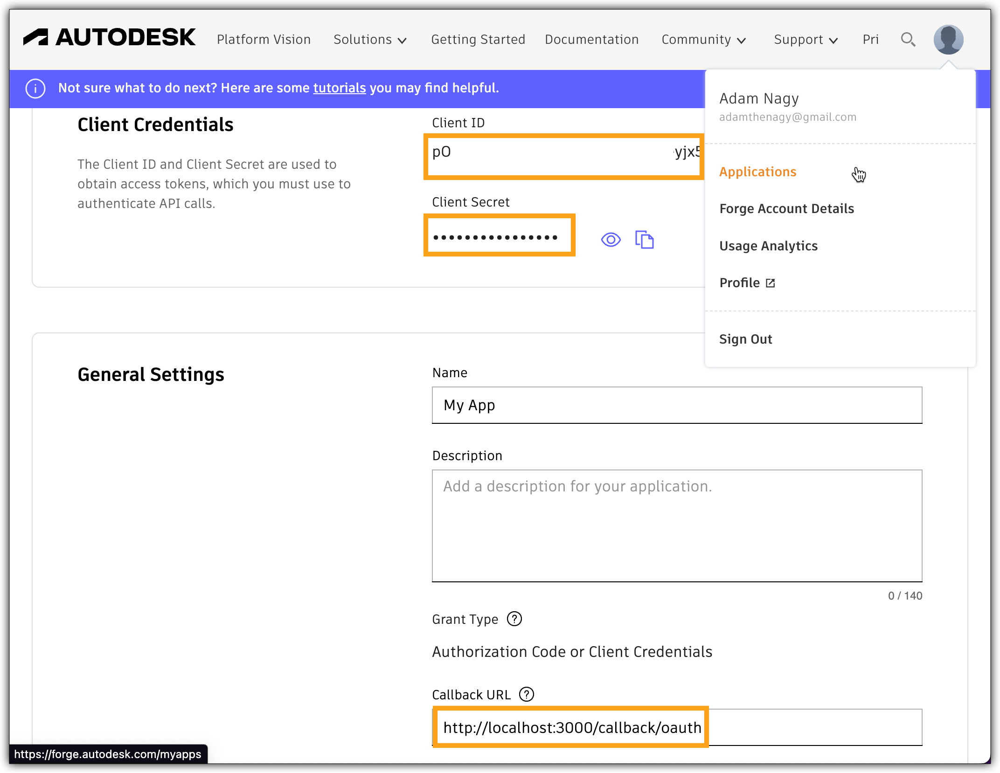
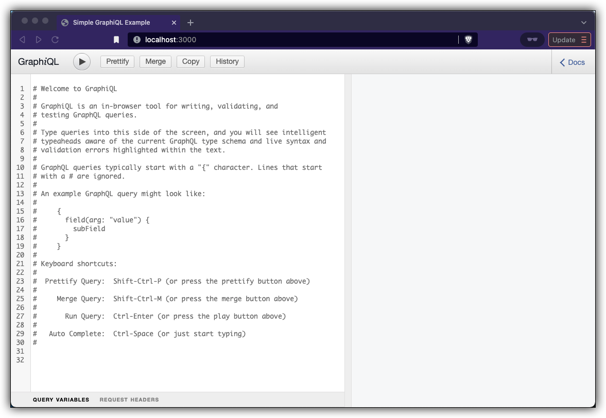
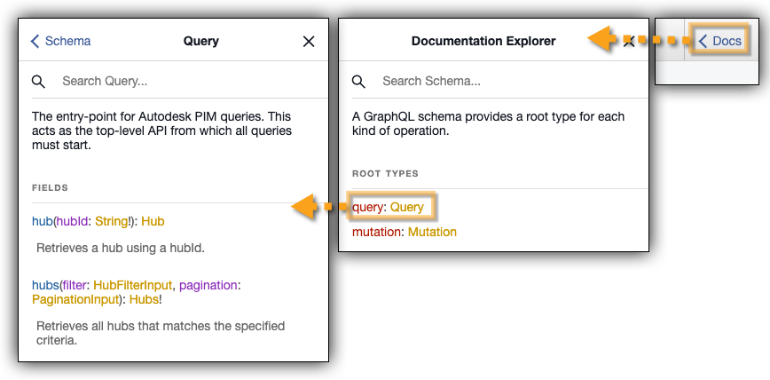
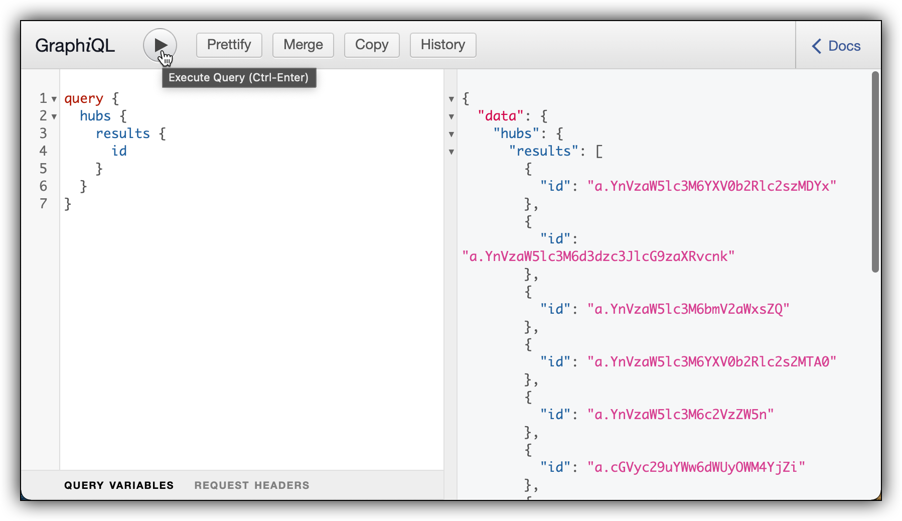

# Data Explorer

The sample is using this [GraphiQL project](https://github.com/graphql/graphiql) that makes it really easy to discover the various GraphQL APIs we provide

## Setting up the app
In the **terminal** run this to install all the necessary components
```
npm i
``` 

Create a `.env` file and fill it with these values based on your **APS app**'s credentials and make sure that the `CallBack URL` of the app is set to `http://localhost:3000/callback/oauth` as shown in the picture\

You also need to set the value of `APS_DATA_ENDPOINT`, which e.g. in case of the [Manufacturing Data Model API](https://forge.autodesk.com/en/docs/fusiondata/v1/developers_guide/overview/) is https://developer.api.autodesk.com/mfg/v3/graphql/public
```
APS_CLIENT_ID=your_client_id
APS_CLIENT_SECRET=your_client_secret
APS_DATA_ENDPOINT="https://developer.api.autodesk.com/mfg/v3/graphql/public"
COOKIE_SECRET=any_arbirtary_string
```
The `COOKIE_SECRET` is only used to sign the session cookie. The APS client secret and the
access/refresh tokens are kept in the server-side session store (see `lib/session.js`) - the
browser only receives an opaque session ID. Because that store is in memory, sessions are lost
when the server restarts, and running multiple server instances would need a shared store
(e.g. Redis) instead.

## Running the app
In a **terminal**, you can run the test with:
```
npm start
```
As instructed in the console, you'll need to open a web browser and navigate to http://localhost:3000 in order to log into your Autodesk account 

## Output

Once you logged in with your Autodesk account in the browser, this should appear:



Now you can check the documentation



And run queries



